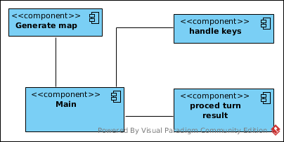
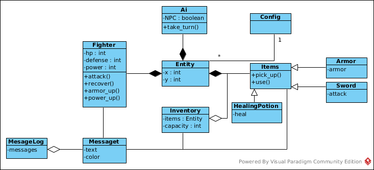
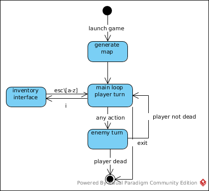

### Design document

#### Игровой процесс
Игрок оказывается в случайно сгенерированном лабиринте. Лабиринт представляет
из себя соеденённые прямоугольные комнаты. В каждой комнате появляться случайное
количетсво мобов и лута. Игрок отображается как `@`. Проходимые клетки `.`. Стены
`#`. Ходить можно только по горизонтали и вертикали. Также атаки по диагонали
 запрещены.   
#### Предметы
В подзмелье встречаются три типа `item`.
- `HealingPotion` - `!` востанавливает hp
- `Armor` - `a` увеличивает defence
- `Sword` - `s` увеличивает attack     
#### Монстры
В подземелье водится два типа NPC. `Orc` and `Trol`
- `Orc` - `o` слабый моб
- `Trol` - `T` сильный моб

#### Боевая система
Боевая система заключается в том, что `player` пытается наступить на `o` или `T`.
Таким образом нанося монстрам урон player power - mob defence

Монстры двигаются к игроку, если игрок видит монстра. Для передвжинея используется
жадная стратегия, монстр передвигается в клетку которая минимизирует растояние до игрока
Если игрок в соседней по вертикали или горизонтали клетки, то монстр наносит игроку урон,
вместо передвежение, равный mob power - player defence. Сначало ходит монстр, затем игрок.

#### Взаимодействие с игрой
Передвижение игрока происходит посредство стрелок.
Чтобы открыть инвентарь нужно нажать клавишу i.

В инвентаре может находится до 25 предметов. Чтобы использовать или снять `item`,
нужно при открытом инвентаре нажать соответсвующую `item` соответсвующую букву
от (a до z)

Чтобы поднять `item` игрок должен находиться с ним в одной клетке и нажать g.
Если это возможно `item` сразу же экипируется. Игрок не может носить одновременно
двa`armor` или два `sword`

### Диаграмма компонентов

### Диаграмма классов
Основная единица взаимодействия все программы `Entity`. По сути в зависимости
от интерфейсов, которые реализует `Entity` этот объект являтся монстром, игроком,
предметом. 

Также `Message` и  `Mesaage log` являются важной частью программы по записи
и отображению лога

### Диаграммы последовательностей

### Диаграма конечных автоматом

